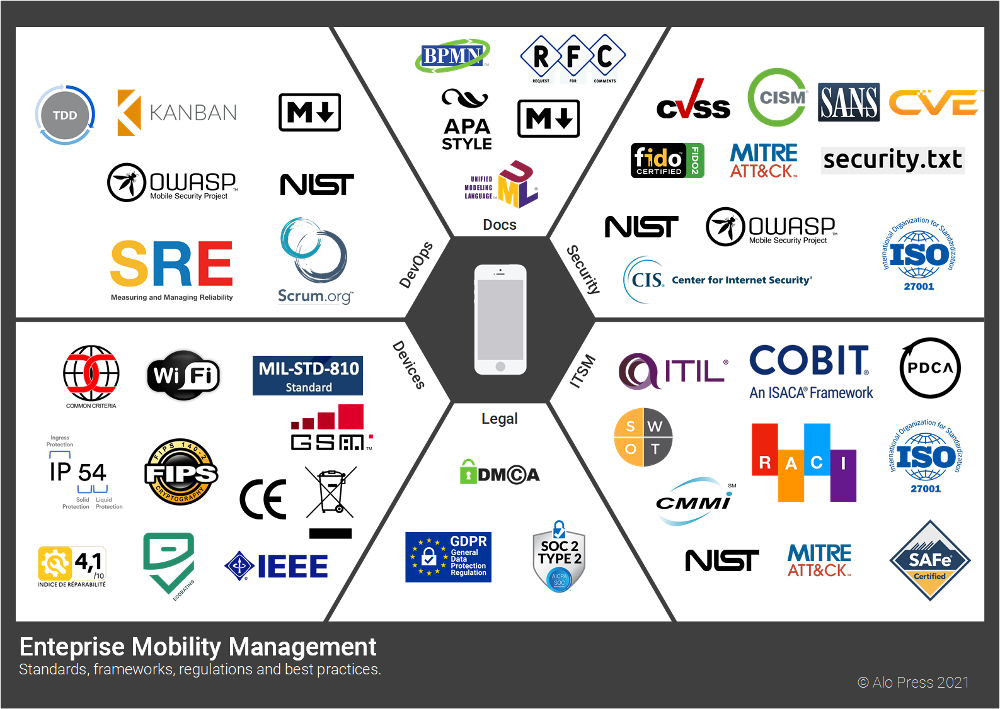

# Standards in EMM
This is a project to collect and maintain a list of standards related to Enterprise Mobility Management (EMM) and Mobile Device Management (MDM) which would be useful engineers working in the field or IT product owers that need to standardize their offering.
This project has two parts:
- The EMM standards chart
- Standards list in Markdown

